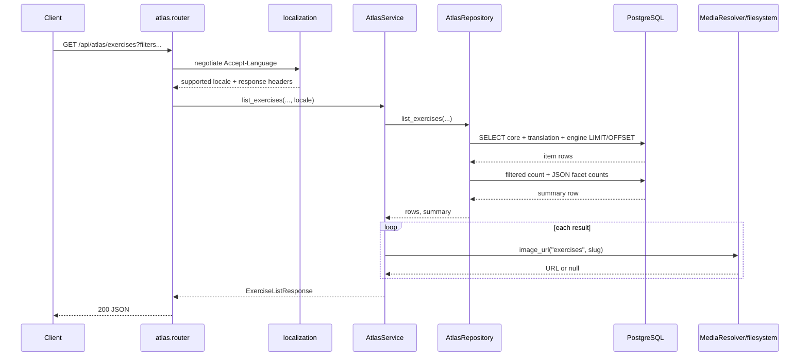
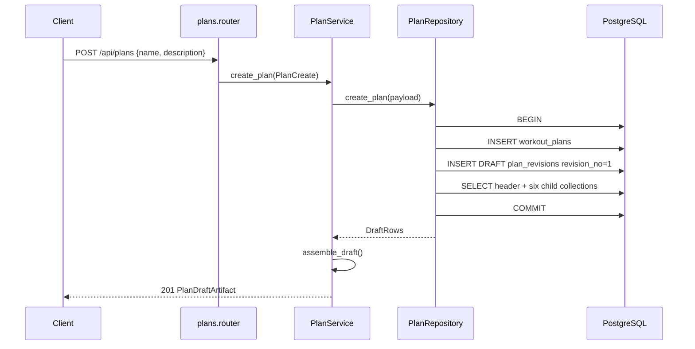

# API endpoint execution flows

## Atlas list and detail reads



Exercise detail follows the same path with one join query. `AtlasService.get_exercise()` creates `ExerciseEngine` only when an engine row exists and at least one evaluated vector (active tension, ETU, recovery modifier, or joint load) is non-null. Muscle detail reads a translation overlay and then scans the muscle hero/gallery directories.

## Add exercise video

```mermaid
sequenceDiagram
    participant Client
    participant Pydantic
    participant Service as AtlasService
    participant Repo as AtlasRepository
    participant DB as PostgreSQL

    Client->>Pydantic: POST /api/atlas/exercises/{slug}/videos
    Pydantic->>Pydantic: normalize_youtube_url(url)
    Pydantic-->>Service: canonical watch URL
    Service->>Repo: get_exercise(slug)
    Repo->>DB: SELECT core + engine
    DB-->>Repo: row or none
    alt unknown exercise
        Service-->>Client: 404
    else equivalent URL already present
        Service-->>Client: 201 existing video_links
    else new URL
        Service->>Repo: add_exercise_video(slug, url)
        Repo->>DB: UPDATE array_append; updated_at=now()
        DB-->>Repo: video_links
        Service-->>Client: 201 ExerciseVideoLinks
    end
```

## Create and load a draft



Draft reads use one header query plus separate ordered queries for days, workout units, slots, targets, variants, and sets. Assembly groups children by parent ID in memory; it is not a database JSON aggregation.

## Save/reconcile a draft

```mermaid
sequenceDiagram
    participant Client
    participant Router as plans.router
    participant Service as PlanService
    participant Repo as PlanRepository
    participant DB as PostgreSQL

    Client->>Router: PUT /api/plans/{id}/draft (nested aggregate)
    Router->>Router: Pydantic structural validation
    Router->>Service: save_draft(plan_id, payload)
    Service->>Repo: save_draft(...)
    Repo->>DB: BEGIN; SET CONSTRAINTS ALL DEFERRED
    Repo->>DB: SELECT plan FOR UPDATE
    Repo->>DB: SELECT DRAFT revision FOR UPDATE
    Repo->>Repo: validate route/payload/revision identity
    Repo->>Repo: compare lock_version
    alt stale lock
        Repo-->>Client: 409 with submitted/current versions
    else current
        Repo->>DB: load existing complete draft
        Repo->>Repo: reject duplicate/foreign nested IDs
        Repo->>DB: batch resolve exercise and muscle slugs
        Repo->>DB: validate progression-model slugs
        Repo->>DB: UPDATE plan metadata
        Repo->>DB: temporarily mark existing variants FALLBACK
        loop submitted tree
            Repo->>DB: INSERT/UPDATE day, unit, slot
            Repo->>DB: replace target-muscle links
            Repo->>DB: INSERT/UPDATE variant and sets
        end
        Repo->>DB: DELETE omitted children leaf-to-root
        Repo->>DB: increment revision lock_version
        Repo->>DB: reload complete draft
        Repo->>DB: COMMIT
        Repo-->>Service: DraftRows
        Service->>Service: assemble_draft()
        Service-->>Client: 200 new artifact/version
    end
```

Existing variants are temporarily changed to FALLBACK so a DEFAULT variant can move or be replaced without violating the partial unique index. Deferred ordinal constraints permit in-transaction reorder. Omitted rows are deleted only after retained stable IDs have been reparented/updated.

## Compact import

```mermaid
sequenceDiagram
    participant Client
    participant Schema as PlanAIImportDocument
    participant Repo as PlanRepository
    participant DB as PostgreSQL

    Client->>Schema: POST /api/plans/import
    Schema->>Schema: validate format, exact fields, days, rest, reps/RIR
    Schema-->>Repo: typed document
    Repo->>DB: BEGIN
    Repo->>DB: resolve all exercise slugs
    Repo->>DB: validate progression-model slugs
    Repo->>DB: insert plan + DRAFT revision
    loop ordered days
        Repo->>DB: insert day
        opt non-rest day
            Repo->>DB: insert workout unit
            loop exercises
                Repo->>Repo: infer role by position
                Repo->>DB: insert slot + DEFAULT variant + sets
            end
        end
    end
    Repo->>DB: reload draft; COMMIT
    Repo-->>Client: 201 PlanDraftArtifact
```

The compact format deliberately drops fallbacks, target muscles, loading metadata, volume axes, notes, and descriptions. Imported slots use DB defaults (`moderate_load`) and no explicit targets.

## Draft analysis

```mermaid
sequenceDiagram
    participant Client
    participant Router as plans.router
    participant Service as PlanAnalysisService
    participant Repo as PlanRepository
    participant Assembler as PlanService.assemble_draft
    participant Resolver as resolve_plan
    participant Evaluator as evaluate_plan
    participant DB as PostgreSQL

    Client->>Router: POST /api/plans/{id}/draft/analysis
    Router->>Service: analyze_draft(id, context)
    Service->>Repo: get_analysis_source(id)
    Repo->>DB: BEGIN REPEATABLE READ READ ONLY
    Repo->>DB: load DRAFT relational tree
    Repo->>DB: load referenced core/engine exercise rows
    Repo->>DB: load all muscle FCSA rows
    DB-->>Repo: consistent AnalysisSourceRows
    Repo-->>Service: source snapshot
    Service->>Assembler: assemble nested PlanDraftArtifact
    Assembler-->>Service: draft
    Service->>Resolver: DEFAULT selection + volume gating + day timing
    Resolver-->>Service: ResolvedPlan + assumptions/diagnostics
    Service->>Evaluator: resolved plan + typed catalog
    Evaluator->>Evaluator: validate vectors; calculate ETU/MRU/JRU
    Evaluator->>Evaluator: periodic recovery simulation
    Evaluator->>Evaluator: summaries, timeline, provenance, diagnostics
    Evaluator-->>Service: PlanAnalysisResult
    Service-->>Client: 200 JSON; no writes
```

The endpoint analyzes the persisted DRAFT, not unsaved frontend edits. The returned `lock_version` lets the client identify a stale result after a save.

## Draft export

Export reuses the same repeatable-read source load and resolver. It then loads the localized progression-model catalog, walks resolved days/DEFAULT exercises/active sets, and emits `agonez-plan-sanity-v2`. The exported progression object is descriptive metadata; no progression algorithm runs.

## Duplicate and delete

- Duplicate uses a single transaction, reads the source plan with `FOR SHARE`, loads its DRAFT, creates a case-insensitively unique `copy`/`copy N` name, creates a new revision whose `based_on_revision_id` points to the source revision, and inserts an entirely new child tree.
- Delete removes `plans.workout_plans`; cascading FKs remove revisions and all descendants. Catalog rows are unaffected.
