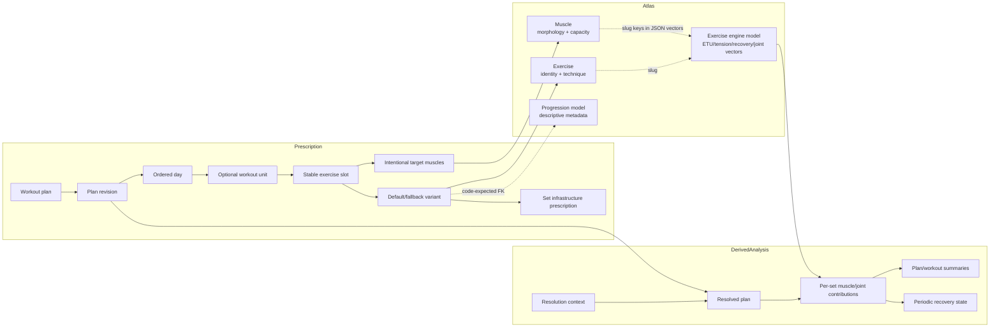

# Domain map

## Persisted and derived domains

## Atlas concepts

### Exercise

`core.exercises` is the canonical catalog identity and presentation record: slug, names, classification enums, execution pattern, technique/comments JSON, media links, timestamps, and a recommended loading-mode-to-rep-range profile. Current load/FCSA/vector values are read from `engine.exercises`, not from `core.exercises`.

### Muscle

`core.muscles` represents anatomical and programming properties. It carries explicit unit-bearing morphology/capacity fields (grams, cubic centimetres, centimetres, degrees, square centimetres), fiber fractions, enum traits, article content, and media links.

### Exercise engine model

`engine.exercises` is a one-row-per-exercise calculated enrichment keyed by exercise slug. Its muscle vectors are sparse JSON objects keyed by `core.muscles.slug`; joint vectors are keyed by strings with no canonical joint table. The database does not enforce an FK from engine slug to the catalog.

### Localization

Exercise, muscle, and progression-model translation rows overlay selected canonical fields. English is the canonical fallback; current code negotiates ten locales. Exercise translations must be `published`; muscle and progression translations have no publication state.

### Progression model

Progression models currently describe how an exercise variant should progress. The API treats the model as metadata and does not execute its algorithm. The compact export embeds localized descriptive fields.

## Prescription concepts

### Plan and revision

A `WorkoutPlan` is the stable aggregate root and human-facing name/description. `PlanRevision` carries status, revision number, optimistic `lock_version`, optional ancestry, timestamps, and an unused/opaque snapshot JSON field. Only one DRAFT per plan is permitted.

### Day and workout unit

A revision has a deterministic, zero-based ordered list of days. A day with no workout unit is a rest day. The physical schema permits at most one workout unit per day.

### Exercise slot

A slot is the stable role/purpose inside a workout, not the exercise itself. It owns role, goal, optional volume axis, loading metadata, intentional target muscles, and one or more exercise variants.

### Exercise variant

Variants are `DEFAULT` or `FALLBACK`. A partial unique index permits at most one DEFAULT per slot; API validation requires exactly one DEFAULT whenever a slot has variants. Analysis selects only DEFAULT. Fallbacks are persisted substitution options.

### Set infrastructure prescription

A set stores a concrete repetition range, RIR 0–4, minimum volume level, and optional loading override/cycle. It does not store kilograms, rest interval, tempo, performance, or completion state.

### Loading metadata

Slots provide a static loading mode and optional repeating 2–52-entry cycle. Sets can inherit or override the mode/cycle. The editor uses exercise recommendations to initialize reps, but analysis currently evaluates only concrete RIR and set activation; it does not apply loading cycles.

## Analysis concepts

### Resolution context

`global_volume_level` and `axis_overrides` determine which prescribed sets are active. `focus_area` is validated and echoed but is not read by the resolver/evaluator.

### Resolved plan

An immutable in-memory projection containing ordered days, optional workouts, slot intent, each DEFAULT exercise, and sets whose `min_volume_level` is at or below the effective volume level. Day ordinal defines 24-hour offsets; weekday is display metadata.

### ETU, MRU, and JRU

- ETU contribution = effective reps × exercise ETU vector value.
- MRU contribution = effective reps × active tension × recovery modifier × RIR multiplier × within-workout cumulative multiplier.
- JRU contribution = effective reps × joint-load vector value × the same RIR/cumulative multipliers.

These acronyms are code/documentation terms, not database types. ETU is aggregated as muscle stimulus, MRU as muscle recovery cost, and JRU as joint recovery cost.

### Recovery state

Recovery is modeled as `hours_to_fresh` debt. A workout adds calculated hours; elapsed time subtracts hours down to zero. The evaluator repeats the whole microcycle until start/end state converges or 256 cycles are reached.

## Explicitly absent concepts

The repository does not currently implement an athlete/user, plan assignment, scheduled calendar session, executed workout, performed set, actual load/reps/RIR, e1RM history, progression state machine, or persisted analysis result. The separate `json-scheme.json` sketches richer plan/prescription/execution structures, but no current runtime module imports it.
