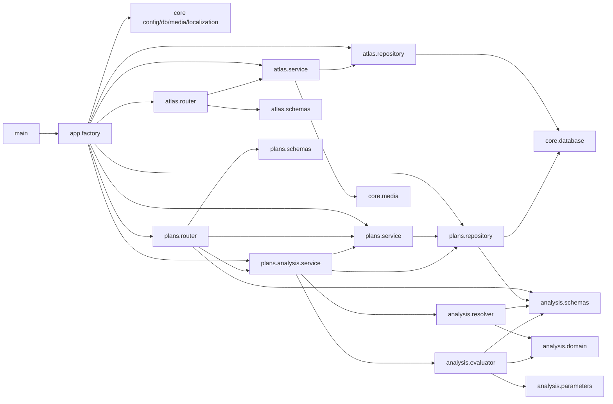
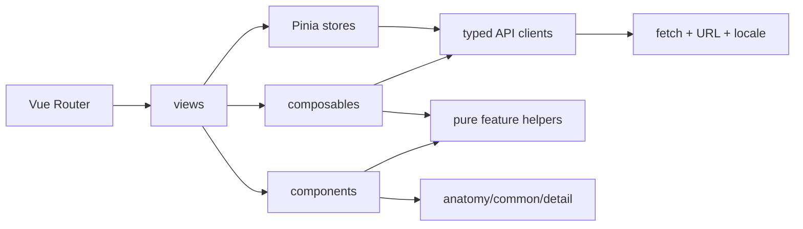
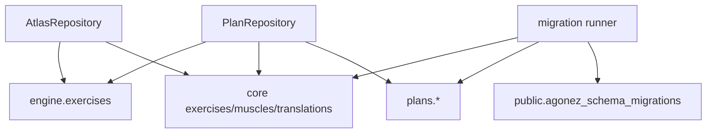

# Module dependencies

## Backend dependency direction

The principal runtime direction is router → service → repository → Psycopg. The analysis path adds service → resolver/evaluator after a repository snapshot.

### Notable coupling

- `PlanRepository` imports `PlanAIImportDocument` from `plans.analysis.schemas`. Persistence therefore depends on a schema module inside the analysis package, even though import is not analysis execution.
- `PlanAnalysisService` calls `PlanService.assemble_draft()` rather than owning a separate row-to-domain mapper.
- Analysis domain and schemas import `ExerciseSlotRole`/`RepRange` from the plan API schema module.

These are directed dependencies, not a Python import cycle in the current graph. They do make the `analysis` package broader than its name suggests.

## Frontend dependency direction

Key paths:

- Atlas views call `atlasApi` and use `useAtlasStore` for browse/hover/capacity state.
- `PlanCreatorView` composes `usePlanDraft`, `usePlanAnalysis`, catalog stores, editor components, and export/import dialogs.
- `usePlanDraft` owns the editable in-memory aggregate and turns HTTP 409 into an explicit conflict state.
- `usePlanAnalysis` owns a persisted-draft snapshot, detects staleness against local dirty state and `lock_version`, and indexes contribution provenance for UI lookup.
- `features/plans/editor.ts` is the pure conversion/validation layer between API DTOs and UI editor state.

## Database dependencies by repository

There is no repository abstraction between plans and Atlas catalog tables: plan slug validation and analysis enrichment query `core`/`engine` directly.

## Dependency-cycle assessment

No direct Python or TypeScript import cycle was found in the inspected source. The higher-level conceptual cycle is intentional: the frontend edits a server artifact, the server returns stable IDs/version, and the frontend rehydrates that artifact as its new baseline. This is a data round-trip, not a module cycle.
