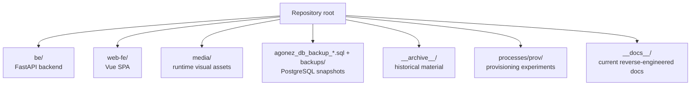

# Repository map

## Top-level map

## Backend: `be/`

| Path | Responsibility |
| --- | --- |
| `src/agonez_api/app.py` | Application factory, dependency wiring, middleware, exception handlers, health/assets routes, router registration. |
| `src/agonez_api/main.py` | Uvicorn/ASGI entry point. |
| `src/agonez_api/core/` | Settings, async database pool, localization negotiation, logging, media path resolution. |
| `src/agonez_api/modules/atlas/` | Atlas router, response schemas, assembly service, SQL repository, YouTube URL normalization. |
| `src/agonez_api/modules/plans/` | Plan router, nested draft schemas, service assembly, transactional repository, plan exceptions. |
| `src/agonez_api/modules/plans/analysis/` | Immutable resolved domain, resolver, equations, recovery simulator, analysis/import/export DTOs, orchestration. |
| `src/agonez_api/migrations/` | Advisory-lock/checksum migration runner and four SQL migrations. |
| `scripts/calibrate_plan_analysis.py` | Read-only calibration/report utility for analysis parameters. Its historical output no longer exactly matches current constants. |
| `tests/` | Unit/contract tests, mocked repository behavior, schema validation, and optional live API scenarios. |
| `docs/` | Feature-specific implementation handoffs; useful evidence, but some claims are stale against current code. |
| `Dockerfile`, `compose.yml` | Backend packaging and deployment. |

The backend intentionally uses no ORM. SQL text in `AtlasRepository` and `PlanRepository` is the code-to-database mapping layer.

## Frontend: `web-fe/`

| Path | Responsibility |
| --- | --- |
| `src/views/` | Route-level Atlas, detail, plan list, and plan editor/analysis screens. |
| `src/api/` | Fetch wrapper, endpoint clients, and hand-maintained TypeScript DTOs. |
| `src/stores/` | Pinia state for Atlas metadata/catalog, progression models, and locale. |
| `src/composables/` | Stateful plan draft and analysis request orchestration. |
| `src/features/plans/` | Pure editor transforms/validation, import parsing, export helpers, search, analysis presentation, and guidance rules. |
| `src/components/plans/` | Nested plan editor and progression/loading controls. |
| `src/components/plans/analysis/` | Analysis timeline, summaries, anatomy maps, diagnostics, and provenance inspectors. |
| `src/components/anatomy/` | Fetches and paints `anatomy.svg` using muscle/joint slug vectors. |
| `src/i18n/` | Ten UI locale bundles and runtime locale loading. |
| `tests/` | Vitest coverage for API state, editors, import/export, localization, and analysis UI. |
| `Dockerfile`, `compose.yml`, `docker/nginx.conf.template` | Multi-stage SPA build and nginx reverse proxy. |

## Data and media artifacts

| Path | Status | Use |
| --- | --- | --- |
| `agonez_db_backup_2026-09-17.sql` | **Authoritative physical snapshot for this documentation** | Schema, constraints, and row-level shape evidence. |
| `agonez_db_backup_2026-09-16.sql` | Prior snapshot | Change comparison. |
| `backups/*.sql` | Historical snapshots | Earlier catalog and initial plans schema. |
| `media/exercises/` | Runtime content | Exercise hero images resolved by slug. |
| `media/muscles/` | Runtime content | Muscle hero images resolved by slug. |
| `media/galleries/muscles/` | Runtime content | Detail galleries, sorted by filename. |
| `media/anatomy.svg` | Runtime contract | Muscle/joint groups painted by slug in the SPA. |
| `data.js`, `api-contract.md` | Historical design inputs | Earlier mock/contract evidence; not authoritative over current routes. |
| `json-scheme.json` | Separate progression design document | A richer plan/prescription/execution JSON design not wired into the current API. |
| `AGONEZ_PLAN_JSON_SPEC.md` | Current compact interchange guide | Human documentation for `agonez-plan-sanity-v2`. |

## Scripts and historical material

- `db_backup.sh` creates a plain SQL dump from the `agonez-db` container.
- `run_db.sh` is a legacy PostgreSQL startup script. It references `PATTAN` in validation but publishes `$MINA`, and expects a root `init.sql` file that is not a tracked regular file in the current checkout.
- `redeploy.sh` rebuilds backend/frontend Compose services and waits on health endpoints.
- `__archive__/` is explicitly historical and was not treated as current behavior.
- `processes/prov/` contains provisioning source material, not the runtime application path.

## Test boundary

Backend tests exercise API schema generation, model validation, services, repository SQL behavior through fakes, the analysis formulas, localization, media, and YouTube normalization. `live_plan_api_scenarios.py` is opt-in integration coverage rather than part of the default test suite. Frontend tests use Vitest/jsdom and fixtures; generated `dist/` and installed `node_modules/` are build artifacts, not source architecture.
