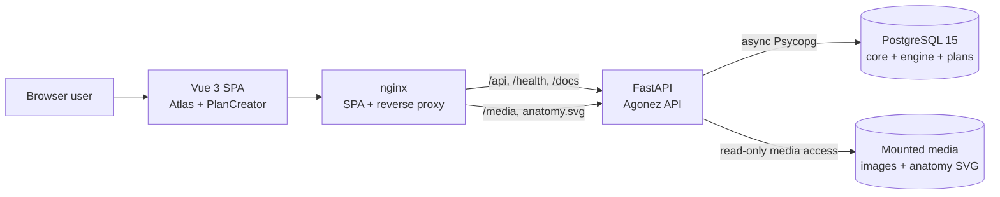
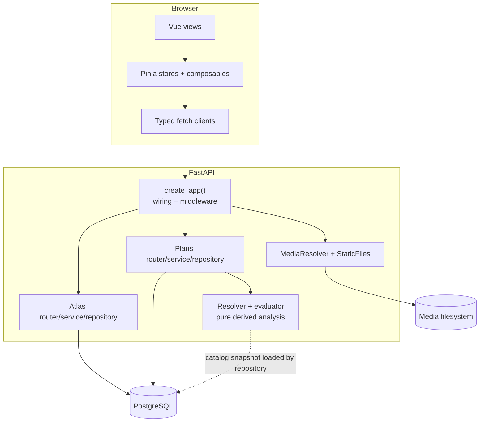

# System overview

## System context

Agonez is deployed as a browser SPA in front of a FastAPI service. The API reads and writes PostgreSQL directly through async Psycopg repositories and resolves images from a mounted filesystem. There is no external identity provider, queue, cache, or ORM in the repository.



The development server replaces nginx with Vite proxying. In the containerized frontend, nginx serves the compiled SPA and proxies API/media paths to the FastAPI host.

## Runtime containers and modules



## Backend request lifecycle

1. `agonez_api.main` creates the ASGI application through `agonez_api.app.create_app()`.
2. The factory creates one async connection pool, both repositories, their services, and a `MediaResolver`, then stores them on `app.state`.
3. FastAPI validates path/query/body data into Pydantic models.
4. Routers obtain services from `app.state`; services coordinate repository work and response assembly.
5. Repositories execute explicit SQL through Psycopg. Atlas reads are generally autocommit statements; multi-row plan mutations run inside transactions.
6. FastAPI serializes typed response models. Request middleware adds `X-Request-ID`; localized reads add `Content-Language` and `Vary: Accept-Language`.

## Architectural boundaries

### Atlas

`modules/atlas` owns exercise and muscle browsing, localized overlays, related-exercise lookup, media URL enrichment, metadata facets, and appending canonical YouTube URLs. It reads `core` and `engine`; its only database write updates `core.exercises.video_links` and `updated_at`.

### PlanCreator persistence

`modules/plans` owns a nested API aggregate backed by normalized relational rows:

```text
WorkoutPlan -> PlanRevision -> Day -> optional WorkoutUnit
            -> ExerciseSlot -> ExerciseVariant -> SetInfraPrescription
```

Slots also reference target muscles; variants reference catalog exercises and, in the code-expected schema, progression models. Draft saves reconcile by stable IDs and use `lock_version` for optimistic concurrency.

### Analysis

`modules/plans/analysis` is pure request-time derivation after repository loading. It does not persist a result or mutate a plan. It selects each slot's `DEFAULT` variant, gates sets by volume level, computes muscle/joint contributions, and runs a periodic recovery simulation.

### Frontend

The SPA consumes the REST contract using hand-maintained TypeScript interfaces. Atlas browse state lives in Pinia; plan draft/analysis orchestration lives in composables. The browser performs presentation transforms but does not reimplement backend evaluator equations.

## Deployment and startup

- The backend image runs migrations before Uvicorn: `python -m agonez_api.migrations && uvicorn ...`.
- Migrations are filename ordered, checksum tracked in `public.agonez_schema_migrations`, transaction wrapped, and serialized with a PostgreSQL advisory lock.
- The backend runs as an unprivileged container user and mounts media read-only.
- PostgreSQL is external to the backend Compose file and is reached through `host.docker.internal`.
- The frontend image is a Node build stage followed by nginx on port 8080.
- `/health/live` is process-only; `/health/ready` runs `SELECT 1` and returns 503 when PostgreSQL is unavailable.

## Security and ownership

**Confirmed:** configuration uses environment variables and `SecretStr`; no credential value is returned by health endpoints or committed in deployment configuration.

**Confirmed:** no authentication, authorization, tenant key, or owner key exists in the API or `plans` schema. Every caller with network access can list, read, change, duplicate, import, analyze, export, and delete all plans.

**Confirmed:** CORS is configured explicitly and credentials are disabled, but CORS is not an authorization boundary.

## Current lifecycle

```mermaid
stateDiagram-v2
    [*] --> DRAFT: create or import
    DRAFT --> DRAFT: save; lock_version increments
    DRAFT --> DRAFT: analyze/export; no mutation
    DRAFT --> [*]: delete plan
    DRAFT --> RELEASED: enum/schema supports it
    RELEASED --> ARCHIVED: enum/schema supports it
```



The `DRAFT`, `RELEASED`, and `ARCHIVED` values are physical schema states, but only DRAFT creation/edit/delete behavior is implemented. No route releases or archives a revision.
