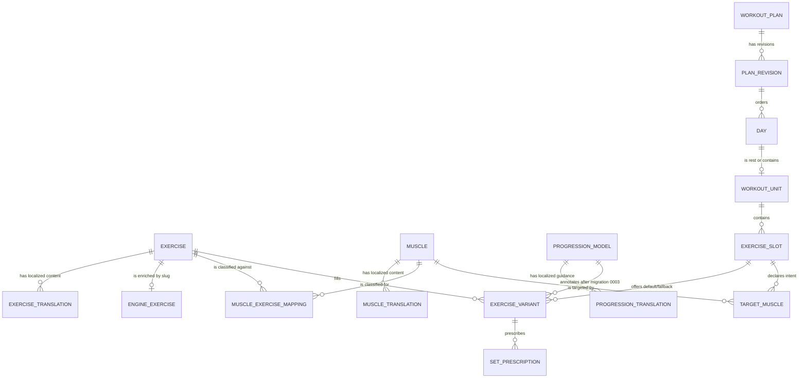

# ERD layer 1 — conceptual

This view omits columns and separates catalog/calculation concepts from plan prescription concepts.

## Relationship explanations

- A catalog exercise has canonical authored content and optional localized overlays. An engine row with the same slug adds calculated load, muscle, ETU, recovery, and joint vectors; this relationship is conventional, not enforced by an FK.
- Muscles have anatomical properties and localized content. `muscle_exercise_mappings` can classify exercise relationships, but it is empty and only its muscle FK is physically enforced.
- A plan is a stable aggregate root. Its revisions can be DRAFT, RELEASED, or ARCHIVED, but current HTTP behavior creates and edits only one DRAFT.
- Every revision owns an ordered microcycle of days. A day without a workout unit is treated as rest; a day can have at most one workout unit.
- A workout contains stable-purpose slots. Each slot can declare intentional target muscles and hold exercise alternatives.
- A populated slot must expose one DEFAULT variant at the API boundary; FALLBACK variants do not participate in analysis.
- A variant owns ordered set prescriptions with rep range, RIR, volume gating, and loading metadata.
- Progression models are descriptive metadata attached to variants only after migration `0003`; the evaluator does not execute them.
