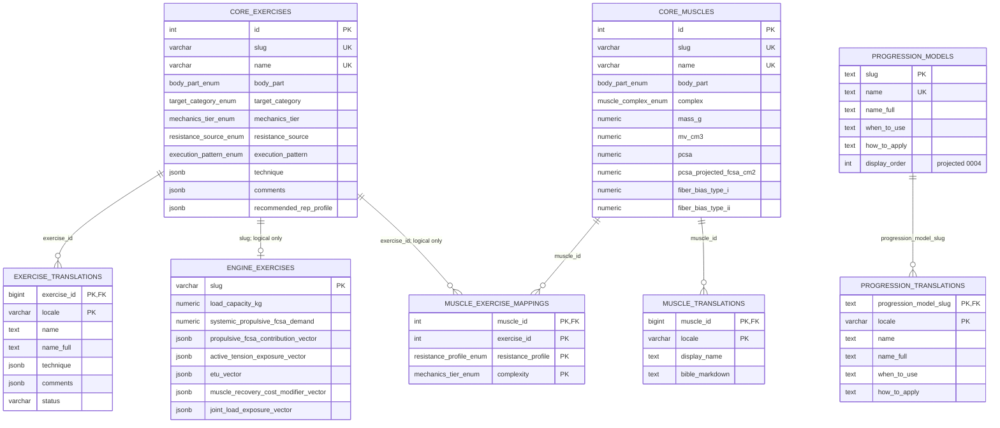
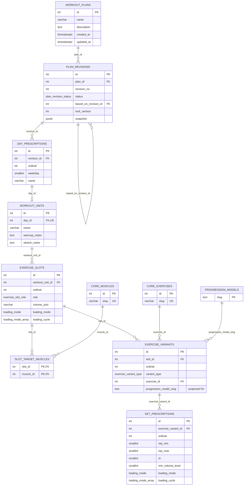

# ERD layer 2 — logical/domain

## Catalog and engine

The engine vectors logically reference muscles/joints through JSON keys. Those are not relational FKs. Muscle keys are validated in the evaluator only as numeric map entries; unknown keys can flow into diagnostics/summaries.

## Plans

The nested JSON API is not stored as one JSON document. `PlanService.assemble_draft()` groups these rows into `PlanDraftArtifact`; saves perform the reverse mapping inside one transaction.
