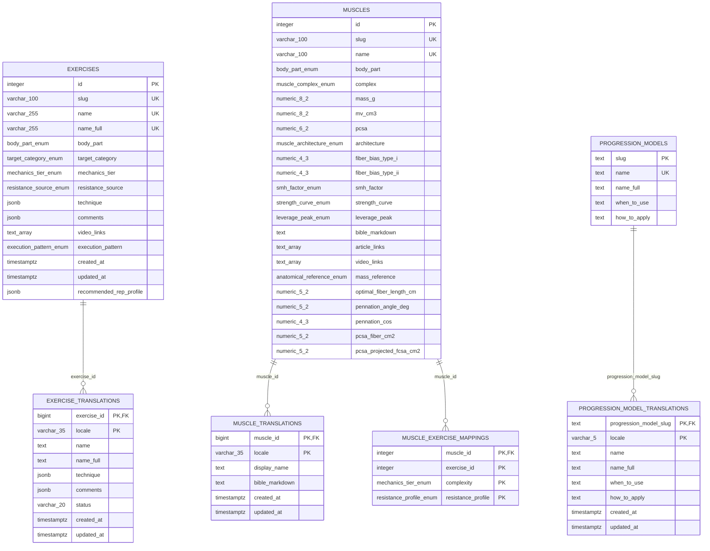
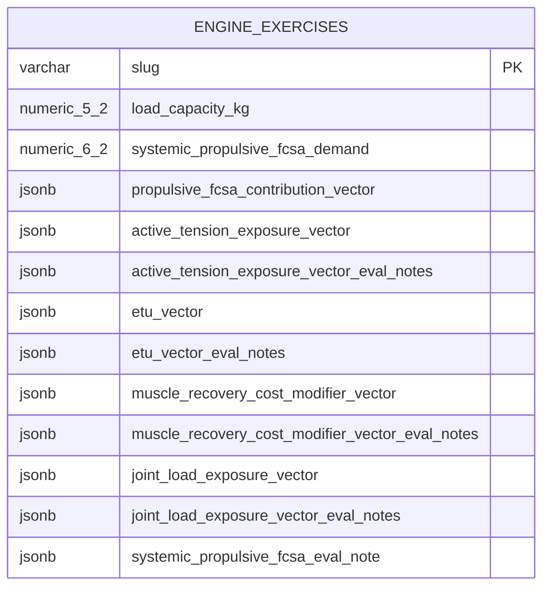
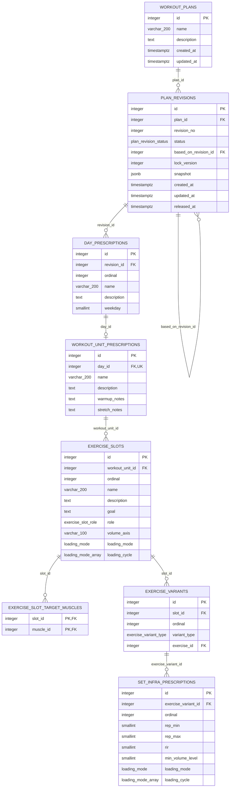
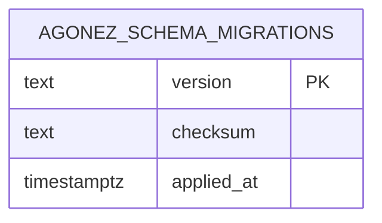

# ERD layer 3 — physical model

The diagrams below describe exact columns in `agonez_db_backup_2026-09-17.sql`. A final overlay lists changes from packaged migrations `0003` and `0004` because current code depends on them.

Legend: `PK` primary key, `FK` foreign key, `UK` unique. Mermaid does not encode nullability; the tables below the diagrams do.

## `core` schema



Nullability exceptions: translated `technique`, translated `comments`, translated muscle `bible_markdown`, and the five muscle measurements from `optimal_fiber_length_cm` through `pcsa_projected_fcsa_cm2` are nullable. All other diagrammed `core` columns are NOT NULL. `muscle_exercise_mappings.exercise_id` has no physical FK in this snapshot.

## `engine` schema



Only `slug` and `systemic_propulsive_fcsa_eval_note` are NOT NULL. The notes column defaults to `{}`. No physical FK links the slug to `core.exercises`.

Expected JSON vector shapes:

```json
{
  "<muscle_slug>": 33.62,
  "<another_muscle_slug>": 4.0
}
```

`joint_load_exposure_vector` uses joint slugs instead:

```json
{
  "glenohumeral_joint": 0.46,
  "lumbar_spine": 0.68
}
```

Eval-note objects usually contain `slug` and `notes` plus calculation-specific fields. Their exact structure is not constrained or consumed by the API.

## `plans` schema



Nullable fields: plan/day/unit/slot descriptions; `based_on_revision_id`, `snapshot`, `released_at`; day `weekday`; slot `name`, `goal`, `volume_axis`, `loading_cycle`; set `loading_mode`, `loading_cycle`. All other plan columns are NOT NULL.

Cross-schema FKs omitted from the diagram for readability:

- `plans.exercise_slot_target_muscles.muscle_id` → `core.muscles.id` (`ON DELETE RESTRICT`).
- `plans.exercise_variants.exercise_id` → `core.exercises.id` (`ON DELETE RESTRICT`).

## `public` migration ledger



All three columns are NOT NULL. The inspected rows are `0001_plancreator_foundation.sql` and `0002_loading_prescriptions.sql`.

## Projected migration overlay required by current code

After `0003` and `0004`:

| Table | Added column | Constraints/indexes |
| --- | --- | --- |
| `plans.exercise_variants` | `progression_model_slug text NULL` | FK to `core.progression_models(slug)` with update cascade/delete restrict; partial btree index where non-null |
| `core.progression_models` | `display_order integer NOT NULL` | `CHECK (display_order > 0)`; unique constraint; documented stable catalog order |

No other physical columns are added by the four packaged migrations.
