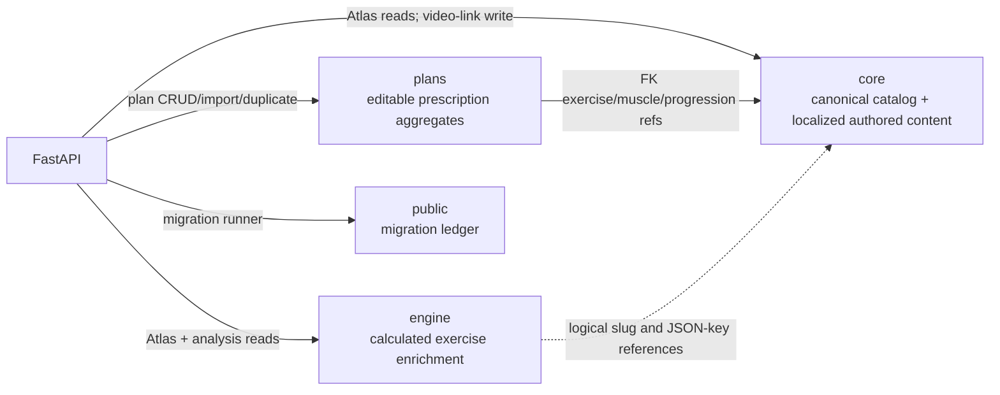

# Database schema ownership

## Responsibility map

## `core`: canonical catalog and authored knowledge

Owns stable exercise/muscle identities, classification enums, muscle morphology/capacity, authored technique/article content, media URLs, recommended rep profiles, progression-model descriptions, and localized overlays.

The API treats `core.exercises.slug` and `core.muscles.slug` as public identifiers. Plans resolve external slugs to integer FKs on write, while engine JSON vectors remain slug-keyed.

`core.progression_models` exists in the latest dump but its creation is not represented by a packaged migration. Packaged migrations only add plan references/order to it.

## `engine`: calculated exercise model

Owns values produced by an external or manual evaluation process: effective load capacity, systemic propulsive FCSA demand, per-muscle contribution/tension/ETU/recovery modifiers, per-joint load exposure, and evaluation notes.

There is no engine-writing code in this repository. The API reads these rows for Atlas detail/list output and plan analysis. This makes `engine` an upstream data product from the API's perspective.

## `plans`: editable prescriptions

Owns aggregate roots, revisions, ordered microcycle days, optional workouts, stable exercise slots, intent targets, default/fallback exercise choices, and per-set prescription metadata.

The schema intentionally references canonical `core` IDs rather than duplicating exercise/muscle attributes. It does not own calculated engine data or performed workout data.

## `public`: migration bookkeeping only

`public.agonez_schema_migrations` is created/read by the migration runner. Application business queries do not use `public`.

## Cross-schema dependencies

| From | To | Mechanism | Assessment |
| --- | --- | --- | --- |
| `plans.exercise_variants.exercise_id` | `core.exercises.id` | Physical FK, restrict delete | Clear catalog dependency |
| `plans.exercise_slot_target_muscles.muscle_id` | `core.muscles.id` | Physical FK, restrict delete | Clear catalog dependency |
| projected `plans.exercise_variants.progression_model_slug` | `core.progression_models.slug` | Migration `0003` FK | Required by current code but absent from latest dump |
| `engine.exercises.slug` | `core.exercises.slug` | Naming/join convention only | Questionable: orphan/drift possible |
| engine muscle-vector keys | `core.muscles.slug` | JSON keys only | Questionable: not DB enforced |
| engine joint-vector keys | no canonical table | JSON keys only | Ungoverned identifier vocabulary |
| `core.muscle_exercise_mappings.exercise_id` | `core.exercises.id` | No FK in snapshot | Likely intended but not enforced |

## Ownership implications

- Catalog deletion is restricted when a plan references an exercise or target muscle, but an engine row can outlive or fail to match a catalog row.
- Renaming an exercise/muscle slug can silently invalidate engine joins/vector interpretation because most slug relationships are not FKs.
- Plan analysis reads `plans`, `core`, and `engine` in one repeatable-read transaction, so those schemas must be co-located in the same PostgreSQL database for current code.
- The current API role needs cross-schema SELECT and plan-schema CRUD; startup additionally needs DDL privileges for migrations.
