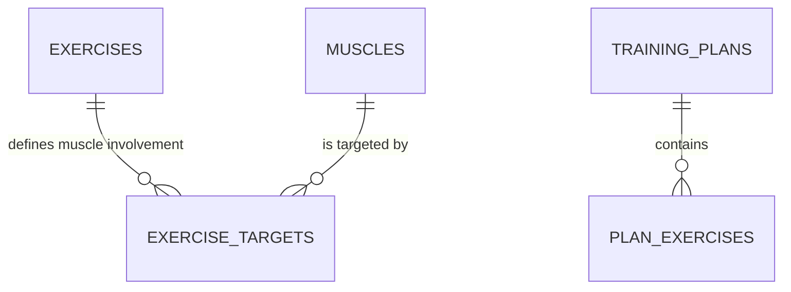
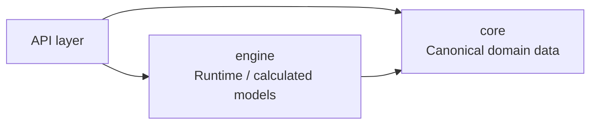
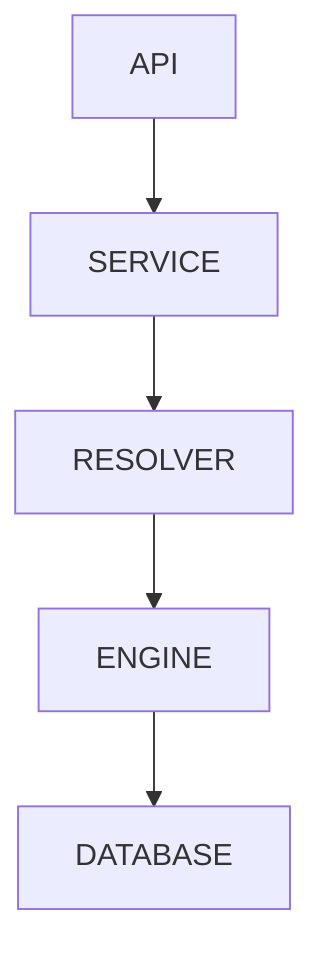
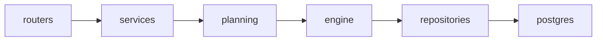
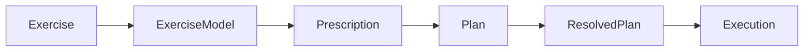
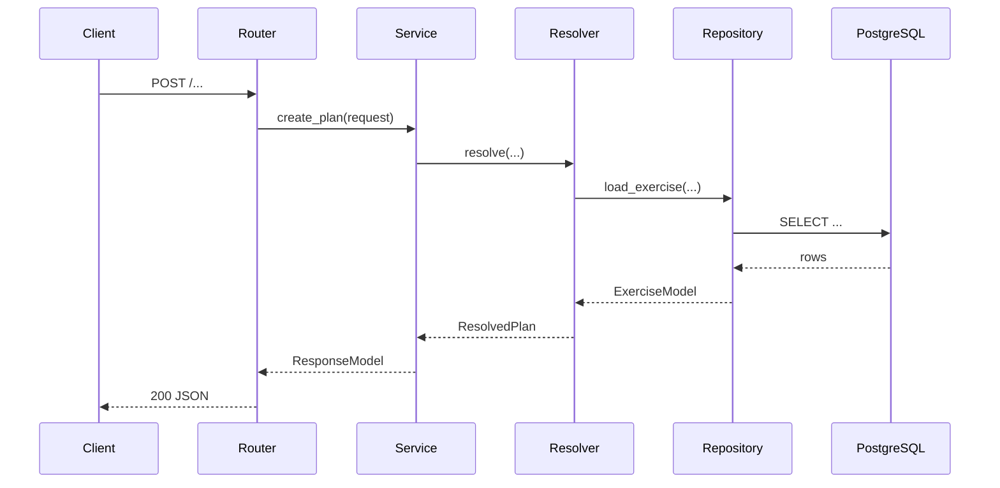
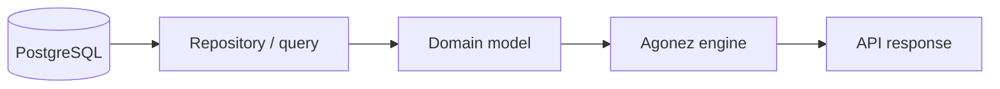
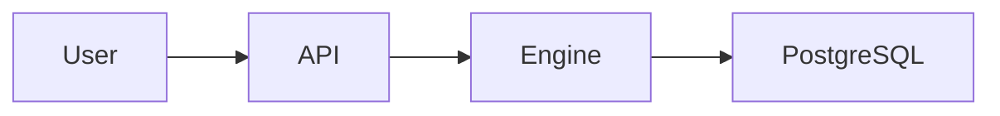

You are acting as a **senior software architect, data architect, API designer, and technical documentation engineer**.

Your task is to enter the current **Agonez repository**, reverse-engineer it carefully, and create a comprehensive but maintainable technical documentation package inside:

```text
__docs__/
```

This is not a superficial README-writing task.

Treat the repository as an existing system that you must understand from evidence in:

* source code,
* SQL,
* database dumps/backups,
* migrations,
* ORM/model definitions,
* API routers/controllers,
* Pydantic/dataclass models,
* configuration,
* tests,
* scripts,
* examples,
* existing documentation.

Your work should primarily be **documentation and reverse engineering**.

Do not redesign the application unless required to document it accurately.

Do not modify production behavior.

Do not perform large code refactors.

Small documentation-oriented additions are acceptable where useful, for example:

* docstrings,
* generated OpenAPI specification,
* example payload files,
* scripts used only to extract documentation metadata.

The expected scope is roughly a **substantial 30–50 minute repository investigation**, not a quick scan.

---

# 1. Project context

The repository is **Agonez**.

Agonez is an engineering-oriented system for modelling resistance training / hypertrophy programming.

The project attempts to formalize concepts that are often represented informally in fitness applications.

The system contains concepts such as:

* exercises,
* muscles,
* exercise biomechanics,
* exercise prescriptions,
* training plans,
* sets,
* reps,
* RIR,
* rep ranges,
* progression models,
* fatigue / recovery modelling,
* training stimulus modelling,
* ETU-like exercise/training-unit calculations,
* muscle-specific exposure/cost vectors,
* exercise mechanics,
* target categories,
* load capacities,
* plan resolution,
* execution of prescribed workouts,
* and APIs exposing some of these models.

The philosophy of the project is closer to an **engineering simulation / prescription engine** than a generic workout tracker.

Some concepts may exist in multiple schemas/modules with different responsibilities.

Do not assume this context is completely accurate.

**The repository itself is the source of truth.**

If the code contradicts this description, document what actually exists.

---

# 2. High-level objective

After completing the task, a new engineer should be able to open:

```text
__docs__/
```

and understand:

1. What the Agonez system consists of.
2. How the repository is structured.
3. What the database contains.
4. How database entities relate to each other.
5. Which database schemas own which responsibilities.
6. How Python code reaches the database.
7. How each API endpoint processes a request.
8. What request/response models the API uses.
9. How major domain objects travel through the system.
10. Where important calculations occur.
11. What the API contract currently looks like.
12. Which parts of the architecture are clear and which remain ambiguous.

Documentation must be **evidence-based**.

Do not invent relationships simply because they would make architectural sense.

---

# 3. First phase: repository reconnaissance

Before creating documentation, inspect the repository systematically.

Look for at least:

```text
*.py
*.sql
*.dump
*.backup
*.bak
*.json
*.yaml
*.yml
*.toml
*.ini
*.env.example
requirements*.txt
pyproject.toml
Dockerfile*
docker-compose*
README*
```

Also inspect:

* package/module structure,
* API framework,
* routers,
* endpoint registration,
* database connectors,
* repositories/DAOs,
* SQL query files,
* models,
* schemas,
* services,
* engines,
* resolvers,
* calculators,
* tests.

Build your understanding before writing conclusions.

If there is a PostgreSQL backup/dump, prioritize it as the authoritative source for the physical database schema.

Possible approaches include tools such as:

```bash
pg_restore -l
pg_restore --schema-only
psql
grep
rg
find
```

depending on what is available.

Do not require a running production database.

If the database backup cannot be restored locally, extract as much schema information from it as possible without destructive operations.

---

# 4. Create documentation structure

Create a clear structure approximately like:

```text
__docs__/
├── README.md
│
├── architecture/
│   ├── system-overview.md
│   ├── repository-map.md
│   ├── module-dependencies.md
│   └── domain-map.md
│
├── database/
│   ├── README.md
│   ├── schema-overview.md
│   ├── erd-layer-1.md
│   ├── erd-layer-2.md
│   ├── erd-layer-3.md
│   ├── schema-ownership.md
│   └── data-dictionary.md
│
├── api/
│   ├── README.md
│   ├── endpoint-catalog.md
│   ├── endpoint-flows.md
│   ├── openapi.yaml
│   └── examples/
│       ├── ...
│
├── flows/
│   ├── data-lineage.md
│   ├── execution-pipeline.md
│   └── ...
│
└── findings/
    ├── ambiguities.md
    └── documentation-gaps.md
```

Adjust this structure if the repository suggests a better organization.

Avoid creating dozens of tiny files.

Prefer a coherent hierarchy with useful documents.

---

# 5. Database reverse engineering

This is one of the most important parts.

Identify:

* PostgreSQL schemas,
* tables,
* views,
* materialized views,
* enums,
* sequences,
* PKs,
* FKs,
* unique constraints,
* indexes where architecturally relevant,
* JSON/JSONB columns,
* arrays,
* nullable/non-nullable properties,
* timestamp/audit fields.

Prefer information extracted from:

1. database backup/schema dump,
2. migration files,
3. SQL DDL,
4. code models,

in roughly that order.

If these disagree, document the disagreement.

---

# 6. Multi-layer ERD

Create several ERD views.

The goal is **progressive disclosure**.

A reader should be able to start with the conceptual system and progressively descend into physical implementation details.

## Layer 1 — conceptual tables and relationships

File:

```text
database/erd-layer-1.md
```

This should be intentionally simple.

Include:

* table/entity names,
* major conceptual relationships,
* cardinality,
* short natural-language descriptions.

Do NOT show every column.

Example style:



Below the diagram, explain relationships in prose.

For example:

```text
A training plan contains multiple prescribed exercise units.

An exercise can reference multiple muscle-level biomechanical parameters.

A progression model can be reused by multiple prescriptions.
```

Use actual repository entities rather than these hypothetical names.

---

## Layer 2 — logical/domain ERD

File:

```text
database/erd-layer-2.md
```

Show:

* tables,
* primary keys,
* important foreign keys,
* important business columns,
* JSONB fields that carry domain meaning,
* enum usage.

Avoid low-value metadata if it makes the diagram unreadable.

Group diagrams by PostgreSQL schema or domain if necessary.

Use several Mermaid diagrams rather than one enormous unreadable ERD.

---

## Layer 3 — physical database model

File:

```text
database/erd-layer-3.md
```

This is the detailed view.

Include where practical:

* exact SQL types,
* PKs,
* FKs,
* nullability,
* arrays,
* JSONB,
* relevant constraints.

If a single Mermaid ER diagram becomes too large, split it by database schema.

For example:

````text
### core schema

```mermaid
...
````

### engine schema

```mermaid
...
```

````

For JSON/JSONB columns, do not merely state `jsonb`.

Describe the inferred internal structure underneath the diagram.

Example:

```text
active_tension_exposure_vector JSONB

Expected shape:

{
  "<muscle_slug>": <numeric exposure>,
  ...
}
````

Use actual examples from the repository where available.

---

# 7. Database schema ownership

Create:

```text
database/schema-ownership.md
```

Explain what each PostgreSQL schema is responsible for.

For example, if schemas similar to these exist:

```text
core
engine
metadata
...
```

determine their actual responsibilities from the repository.

Create a Mermaid diagram such as:



Again: infer this from evidence, not from the example.

Also note questionable cross-schema dependencies.

---

# 8. Data dictionary

Create:

```text
database/data-dictionary.md
```

For every important table document:

* schema.table,
* purpose,
* primary key,
* important columns,
* foreign keys,
* JSON structures,
* enums,
* units.

Units are particularly important.

Examples of units might include:

* kg,
* repetitions,
* RIR,
* hours,
* cm²,
* percentages,
* normalized scores,
* ratios,
* timestamps.

Do not guess units silently.

Use one of:

```text
Unit: kg
Unit: repetitions
Unit: dimensionless
Unit: unknown
Unit: inferred — verify
```

Clearly distinguish:

* explicit,
* inferred,
* unknown.

---

# 9. Repository architecture map

Create:

```text
architecture/repository-map.md
```

Explain the significant source directories/modules.

Do not list every file.

Explain responsibilities such as:

```text
API
Domain models
Database access
Planning engine
Resolvers
Simulation
Calculation
Configuration
Utilities
Scripts
Tests
```

Use actual repository structure.

Include a Mermaid diagram similar to:



---

# 10. Python module dependency map

Create:

```text
architecture/module-dependencies.md
```

Inspect imports and runtime relationships.

Document the major dependency direction between packages/modules.

Use Mermaid.

Example:



Highlight dependency cycles if you discover them.

Do not attempt to create a complete import graph for every Python module unless the repository is very small.

Focus on architectural dependencies.

---

# 11. Domain map

Create:

```text
architecture/domain-map.md
```

Map the major domain concepts.

This should be less implementation-specific than the ERD.

Possible concepts to investigate include:

```text
Muscle
Exercise
Biomechanical model
Training prescription
Exercise unit
Set prescription
Rep range
RIR
Progression model
Training plan
Resolved plan
Execution
Recovery
Fatigue
Stimulus
ETU
```

Only include concepts actually represented in the repository.

A Mermaid `classDiagram` or `flowchart` may work well.

For example:



Use accurate project terminology.

---

# 12. API discovery

Identify the API framework.

Possibilities include:

* FastAPI,
* Flask,
* Django,
* custom HTTP layer.

Find all currently reachable API endpoints.

Create:

```text
api/endpoint-catalog.md
```

For every endpoint document:

* HTTP method,
* route,
* Python handler,
* input model,
* output model,
* major database objects touched,
* major services/functions called,
* side effects,
* error cases visible in code.

A table is appropriate.

Example:

| Method | Path | Handler | Input | Output | Main responsibility |
| ------ | ---- | ------- | ----- | ------ | ------------------- |

Do not describe endpoints that are dead/unregistered unless clearly marked as such.

---

# 13. API endpoint execution flows

This is another major deliverable.

Create:

```text
api/endpoint-flows.md
```

For each important endpoint, trace the actual Python call flow.

Use Mermaid `sequenceDiagram`.

The desired level is approximately:



But use actual names.

For complex endpoints, include:

1. request validation,
2. service invocation,
3. DB reads,
4. calculations,
5. domain transformations,
6. DB writes,
7. response construction.

If an endpoint is trivial, group several related trivial endpoints rather than generating repetitive diagrams.

---

# 14. Data lineage

Create:

```text
flows/data-lineage.md
```

Track how important data moves between:

```text
PostgreSQL
    ↓
Python database model
    ↓
domain model
    ↓
calculation/resolution
    ↓
API response
```

and the reverse direction for writes.

Identify key transformations.

For example:



Replace placeholders with real components.

For JSONB-heavy models, document where JSON becomes typed Python structures.

---

# 15. Execution / calculation pipeline

If the repository contains a meaningful planning, resolving, simulation, scoring, progression, recovery, or prescription pipeline, create:

```text
flows/execution-pipeline.md
```

Trace it end-to-end.

For example, investigate whether concepts similar to:

```text
PlanDraft
→ Resolver
→ ResolvedPlan
→ Exercise Units
→ ETU/MRU/JRU calculations
→ simulation
→ response
```

exist.

Do not assume these exact names exist.

Determine the actual pipeline from code.

Use Mermaid flowcharts and, where helpful, sequence diagrams.

Document:

* input,
* intermediate representations,
* transformations,
* calculations,
* output.

This document should make it possible for an engineer to answer:

> "If I submit a plan to Agonez, what exactly happens to it?"

if that workflow exists.

---

# 16. API example payloads

Create:

```text
api/examples/
```

For each significant API model or endpoint, create useful JSON examples.

Prefer names such as:

```text
create_plan.request.json
create_plan.response.json
exercise.request.json
exercise.response.json
progression_model.example.json
```

Use models, type hints, validators, tests, and existing fixtures as evidence.

Values should be realistic and domain-valid.

Do not generate arbitrary fake shapes.

If units are known, choose values consistent with the units.

For example:

```json
{
  "sets": 3,
  "rep_range": {
    "min": 8,
    "max": 12
  },
  "rir": 2
}
```

only if this reflects the actual API.

Ensure every JSON file is syntactically valid.

---

# 17. OpenAPI

Create:

```text
api/openapi.yaml
```

If the framework can generate OpenAPI automatically, use the framework-generated schema as the starting point.

For example, with FastAPI, prefer extracting the application OpenAPI model rather than manually inventing it.

Then check that it contains:

* all registered endpoints,
* request schemas,
* response schemas,
* enums,
* error responses where available.

If automatic generation is impossible because the app cannot be imported without external infrastructure, reconstruct the specification carefully from code and state that fact in documentation.

The OpenAPI document should be valid OpenAPI YAML.

Where possible validate it syntactically.

---

# 18. Mermaid documentation opportunities

Beyond ERDs and endpoint sequences, use Mermaid where it materially improves understanding.

Good candidates include:

## System context



## Module architecture

```mermaid
flowchart TB
```

## Domain lifecycle

```mermaid
stateDiagram-v2
```

## Object/data transformation

```mermaid
flowchart LR
```

## API calls

```mermaid
sequenceDiagram
```

## Domain object relationships

```mermaid
classDiagram
```

## Database

```mermaid
erDiagram
```

Do not use Mermaid merely for decoration.

Every diagram should answer an architectural question.

---

# 19. Suggested diagrams

Try to determine whether the repository provides enough evidence to document these diagrams:

### A. System context diagram

Who/what interacts with Agonez?

### B. Container/module diagram

What are the major runtime components?

### C. Database schema ownership

Which DB schemas own which data?

### D. ERD conceptual

How do domain entities relate?

### E. ERD logical

How do tables relate?

### F. ERD physical

What are the actual columns and types?

### G. API request lifecycle

How does an HTTP request reach PostgreSQL and return?

### H. Planning/resolution pipeline

How does a plan become a resolved/calculated object?

### I. Data lineage

Where does data change representation?

### J. Python module dependency graph

Which modules depend on which layers?

### K. Important state machines

If the application contains states such as:

```text
draft
resolved
active
executed
completed
```

document them with `stateDiagram-v2`.

Do not invent states if none exist.

---

# 20. Documentation style

Documentation should be written for engineers.

Prefer:

* precise terminology,
* short technical explanations,
* diagrams,
* tables,
* references to actual source files,
* references to actual classes/functions,
* explicit uncertainty.

Avoid marketing language.

Avoid statements like:

> "This powerful architecture elegantly..."

Instead write:

> `PlanResolver.resolve()` converts the API-level plan representation into the internal `ResolvedPlan` structure and loads exercise metadata from PostgreSQL.

Where possible, reference code locations using relative paths, for example:

```text
src/agonez/api/routes/plans.py
src/agonez/engine/resolver.py
```

When useful, mention symbols:

```text
PlanResolver.resolve()
ExerciseRepository.get_by_slug()
```

---

# 21. Evidence classification

When documenting inferred behavior, distinguish between:

```text
Confirmed
Inferred
Unknown
Potentially stale
```

Examples:

```text
**Confirmed:** `exercise_id` references `core.exercises.id`.

**Inferred:** values in `load_capacity` appear to be kilograms based on surrounding calculation code.

**Unknown:** no explicit unit definition was found.

**Potentially stale:** this SQL migration defines a column that is absent from the latest backup.
```

This is particularly important for a reverse-engineered project.

---

# 22. Ambiguities report

Create:

```text
findings/ambiguities.md
```

List areas where the architecture cannot be determined confidently.

Examples:

* unused tables,
* duplicate models,
* conflicting definitions,
* dead endpoints,
* schema mismatches,
* unclear units,
* JSONB without validation,
* apparently unused columns,
* duplicated domain logic.

Do not "fix" these automatically.

Document them.

---

# 23. Documentation gaps report

Create:

```text
findings/documentation-gaps.md
```

Identify high-value improvements that could be performed later.

Rank them loosely by:

```text
High
Medium
Low
```

This is a priority list for documentation quality, **not a critique of code quality**.

Examples:

```text
HIGH — progression model JSONB schema has no explicit typed model.

HIGH — unit of load_capacity is not encoded in schema.

MEDIUM — endpoint X lacks an explicit response model.

LOW — utility package contains undocumented helper functions.
```

---

# 24. Root documentation index

Create:

```text
__docs__/README.md
```

This must be the navigation entry point.

Include:

1. one-paragraph system description,
2. documentation map,
3. suggested reading order,
4. major architectural components,
5. links to all important documents.

Suggested reading order:

```text
1. System overview
2. Domain map
3. Database ERD layer 1
4. Database ERD layer 2
5. API endpoint catalog
6. API endpoint flows
7. Execution pipeline
8. Database ERD layer 3
9. Data dictionary
```

---

# 25. Quality checks

Before finishing:

## Mermaid

Check Mermaid blocks for obvious syntax issues.

Keep node IDs Mermaid-safe.

Avoid excessively huge diagrams.

Split diagrams when needed.

## JSON

Validate every `.json` file.

For example:

```bash
python -m json.tool file.json
```

or equivalent.

## YAML

Validate that:

```text
api/openapi.yaml
```

is parseable YAML.

If possible, also check basic OpenAPI validity.

## Links

Check relative links between documentation files.

## Accuracy

Spot-check documentation against code and database definitions.

---

# 26. Important constraints

Do NOT:

* change application semantics,
* delete files,
* rename production modules,
* perform broad refactors,
* normalize the database,
* invent missing architecture,
* invent foreign keys that do not exist,
* silently turn assumptions into facts,
* expose secrets from `.env`, backups, credentials, tokens, or connection strings.

If secrets are encountered, do not copy them into documentation.

Redact them.

---

# 27. Git scope

The intended change should overwhelmingly consist of:

```text
__docs/**
```

If you need to create a small documentation extraction script, place it somewhere clearly documentation-oriented, preferably under:

```text
__docs__/tools/
```

Do not alter production code unless absolutely necessary.

---

# 28. Work strategy

Use roughly this sequence:

### Phase 1 — reconnaissance

Inspect repository structure, dependencies, API, database artifacts.

### Phase 2 — architecture reconstruction

Identify:

* runtime layers,
* module responsibilities,
* domain concepts,
* database boundaries.

### Phase 3 — database documentation

Produce:

* schema overview,
* multi-layer ERD,
* schema ownership,
* data dictionary.

### Phase 4 — API reverse engineering

Produce:

* endpoint catalog,
* endpoint call flows,
* request/response examples,
* OpenAPI.

### Phase 5 — execution/data flows

Produce:

* data lineage,
* major processing pipelines,
* state diagrams where relevant.

### Phase 6 — verification

Validate Mermaid as far as practical, JSON, YAML, links, and cross-check key claims.

### Phase 7 — final summary

Report:

* files created,
* architecture discovered,
* major ambiguities,
* anything that could not be documented confidently.

---

# 29. Depth requirement

Do not stop after discovering the first router or first SQL file.

Explore enough of the repository to form an architectural model.

Follow imports.

Follow database calls.

Follow model transformations.

Trace several representative API endpoints all the way through their implementation.

Inspect the database schema rather than inferring it exclusively from application code.

This task should feel like a **technical due-diligence pass over Agonez**.

---

# 30. Expected final result

At completion, I want to be able to browse:

```text
__docs__/
```

and understand Agonez at three levels:

```text
CONCEPTUAL
What are the major domain concepts and components?

LOGICAL
How do modules, tables, APIs, and data structures interact?

PHYSICAL
What are the exact tables, fields, SQL types, Python models, API schemas, and call paths?
```

The most important principle is:

> Start simple, progressively reveal implementation detail.

The documentation should therefore allow me to understand the project without immediately drowning in individual columns, Python functions, or JSON fields.

At the same time, the lowest documentation layer should be detailed enough to serve as a reference during development.

Begin by exploring the repository. Do not start writing documentation until you have established a reasonably complete map of the codebase and database artifacts.