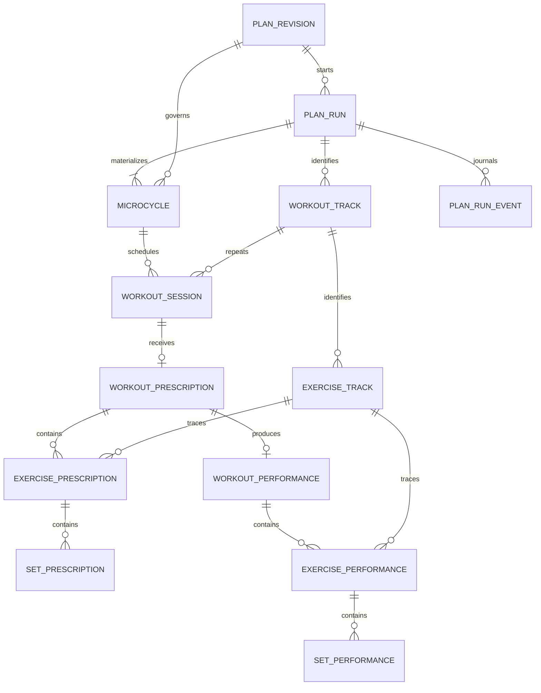
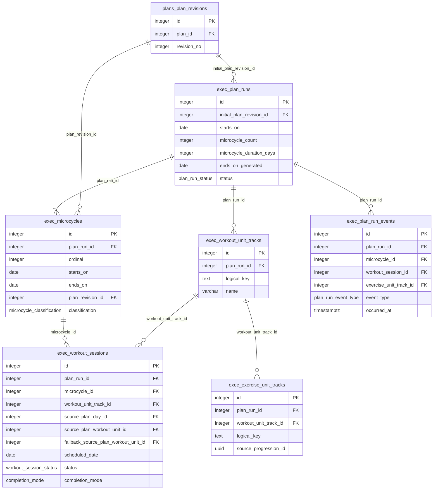

# Execution ERDs

## Conceptual ERD



## Physical run, calendar, and identity ERD



## Physical prescription and performance ERD

```mermaid
erDiagram
    exec_workout_sessions {
        integer id PK
        integer microcycle_id FK
        workout_session_status status
        completion_mode completion_mode
    }
    exec_workout_unit_prescriptions {
        integer id PK
        integer workout_session_id FK_UK
        integer source_plan_revision_id FK
        integer source_plan_workout_unit_id FK
        varchar name_snapshot
        text prescription_comment
    }
    exec_exercise_unit_prescriptions {
        integer id PK
        integer workout_unit_prescription_id FK
        integer exercise_unit_track_id FK
        integer source_plan_exercise_slot_id FK
        integer source_plan_exercise_variant_id FK
        integer prescribed_exercise_id FK
        integer previous_exercise_performance_id FK
        integer ordinal
    }
    exec_set_prescriptions {
        integer id PK
        integer exercise_unit_prescription_id FK
        integer source_plan_set_infra_id FK
        integer ordinal
        numeric prescribed_load_kg
        smallint rep_min
        smallint rep_max
        rir_prescription target_rir
    }
    exec_workout_unit_performances {
        integer id PK
        integer workout_unit_prescription_id FK_UK
        performance_status status
        timestamptz started_at
        timestamptz completed_at
    }
    exec_exercise_unit_performances {
        integer id PK
        integer workout_unit_performance_id FK
        integer prescribed_exercise_unit_id FK_UK
        integer exercise_unit_track_id FK
        integer actual_exercise_id FK
        exercise_execution_mode execution_mode
        jsonb etu_vector_snapshot
    }
    exec_set_performances {
        integer id PK
        integer exercise_unit_performance_id FK
        integer prescribed_set_id FK_UK
        integer ordinal
        performed_set_status status
        numeric load_kg
        smallint repetitions
        smallint rir
    }

    exec_workout_sessions ||--o| exec_workout_unit_prescriptions : workout_session_id
    exec_workout_unit_prescriptions ||--o{ exec_exercise_unit_prescriptions : workout_unit_prescription_id
    exec_exercise_unit_prescriptions ||--o{ exec_set_prescriptions : exercise_unit_prescription_id
    exec_workout_unit_prescriptions ||--o| exec_workout_unit_performances : workout_unit_prescription_id
    exec_workout_unit_performances ||--o{ exec_exercise_unit_performances : workout_unit_performance_id
    exec_exercise_unit_prescriptions ||--o| exec_exercise_unit_performances : prescribed_exercise_unit_id
    exec_exercise_unit_performances ||--o{ exec_set_performances : exercise_unit_performance_id
    exec_set_prescriptions ||--o| exec_set_performances : prescribed_set_id
    exec_exercise_unit_performances ||--o{ exec_exercise_unit_prescriptions : previous_exercise_performance_id
```

Additional cross-schema lineage FKs point to `plans.day_prescriptions`,
`plans.workout_unit_prescriptions`, `plans.exercise_slots`, `plans.exercise_variants`,
`plans.set_infra_prescriptions`, and `core.exercises`.

