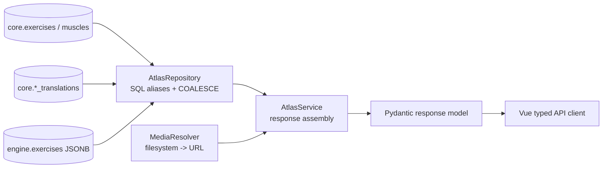
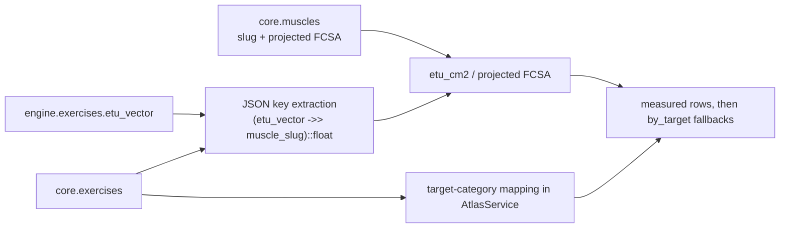
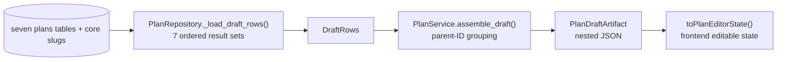
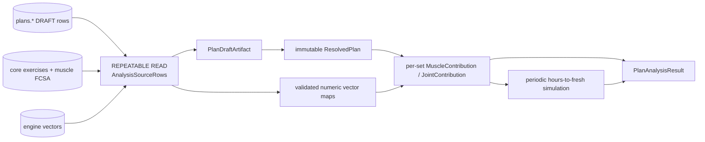

# Data lineage

## Atlas read lineage

Important transformations:

1. The repository casts PostgreSQL enums to text and aliases engine fields (`load_capacity_kg` becomes API `load_capacity`).
2. Localized fields use SQL `COALESCE(translation, canonical)` independently per field. Exercise translations additionally require `status='published'`.
3. Psycopg's dict row factory returns JSONB as Python dictionaries, arrays as Python lists, numeric values as `Decimal`, and timestamps as `datetime`.
4. `AtlasService` adds filesystem-derived image/gallery URLs and converts link arrays to lists.
5. Pydantic validates/narrows JSON vector values to `dict[str, float]` for exposed vectors and serializes declared numeric fields as JSON numbers.
6. The TypeScript client trusts hand-maintained DTOs; there is no generated SDK/runtime schema validation in the browser.

### JSONB typing boundary

`core.exercises.recommended_rep_profile` becomes the typed `RecommendedRepProfile` response model. Engine vectors exposed through `ExerciseEngine` become `dict[str, float]`. Technique/comments remain `dict[str, Any]`; evaluation-note JSON is not exposed at all.

## Related-exercise lineage

The fallback category mapping is Python configuration, not `core.muscle_exercise_mappings`. That relational mapping table is empty and unused.

## Plan read lineage

The API-facing plan references exercises and muscles by slug, while relational rows store integer FKs. Repository joins translate IDs back to slugs on reads.

## Plan write lineage

```mermaid
flowchart RL
    Editor["Vue editor state"]
    DTO["toPlanDraftUpdate()\nnormalized ordinals"]
    Pydantic["PlanDraftUpdate\nstructural validation"]
    Resolve["batch slug -> integer ID resolution"]
    Reconcile["stable-ID upsert + omission delete"]
    Tables[("plans relational tables")]
    Reload["reload + assemble"]
    Baseline["new frontend baseline\nnew lock_version"]

    Editor --> DTO --> Pydantic --> Resolve --> Reconcile --> Tables --> Reload --> Baseline
```

Identity transformations:

- Existing children carry positive database IDs and may move/reorder within the same draft.
- New children use `id: null`; PostgreSQL generates identity values.
- Any submitted ID not already owned by the current DRAFT is rejected.
- Missing existing IDs mean deletion, performed leaf-to-root after retained entities are updated.
- Exercise/muscle/progression slugs are validated in batches before mutation.

## Analysis lineage

`PlanAnalysisService._catalog()` is the JSON-to-domain boundary. It accepts only Python mappings for vectors and numeric FCSA values. `_validate_vector()` then removes boolean, nonnumeric, negative, or non-finite entries and emits diagnostics rather than failing the whole request.

No derived analysis row is written to PostgreSQL. Provenance exists only in the response and frontend memory.

## Compact import/export lineage

### Import

`agonez-plan-sanity-v1|v2 JSON` → Pydantic validation → catalog slug resolution → generated Plan/DRAFT/day/unit/slot/DEFAULT variant/set rows → normal `PlanDraftArtifact`.

Information intentionally absent from the compact format is initialized empty/default: fallbacks, target muscles, descriptions, notes, volume axes, loading modes/cycles, and stable IDs.

For v2, progression-model descriptive fields are accepted but only `progression_model.slug` is persisted; client-supplied names/guidance are ignored.

### Export

Persisted DRAFT → resolution context/set gating → DEFAULT exercises only → localized exercise/progression labels → v2 JSON. Internal IDs, slot roles, targets, loading metadata, and analysis vectors are omitted.

## Media lineage

Database rows never store local image paths. A canonical slug plus a collection determines the search path. The service checks extensions in fixed priority order and emits either an API-relative URL or configured public-base URL. The frontend passes relative URLs through its API base URL helper.
