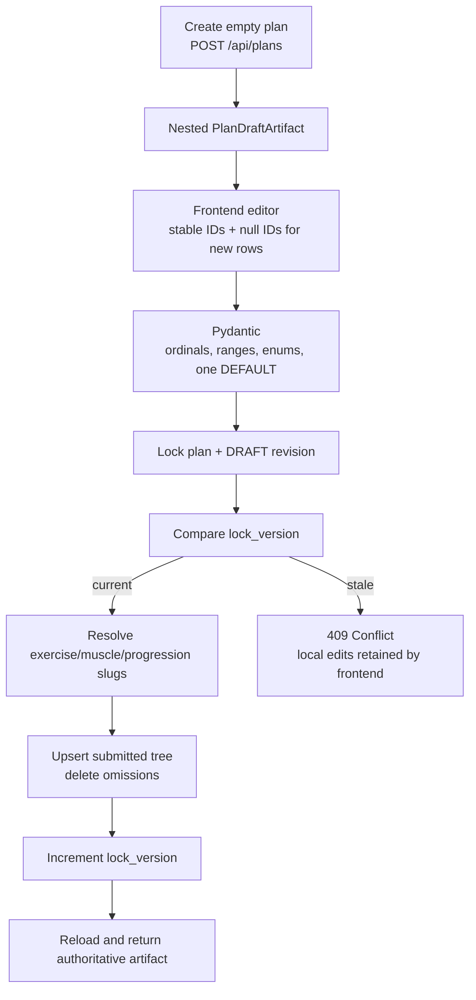
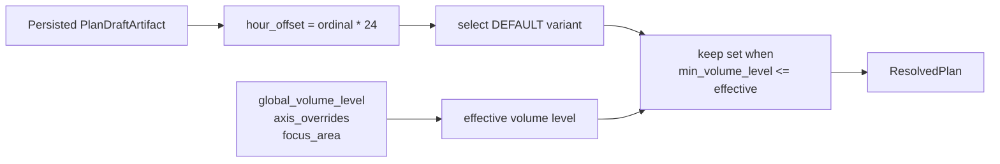
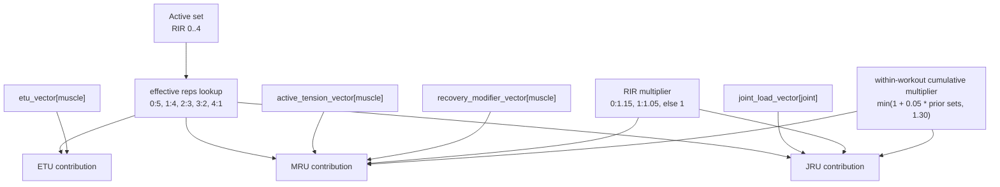
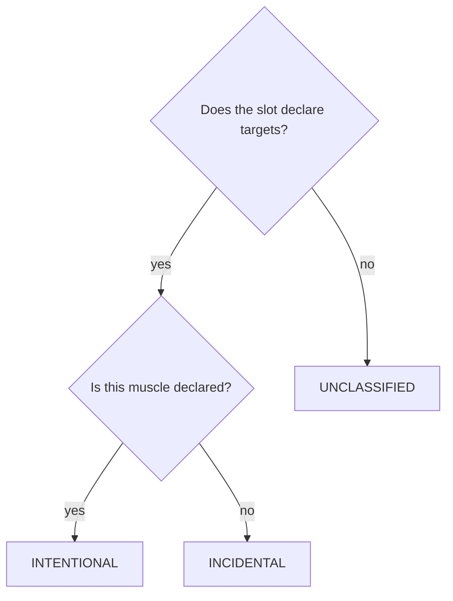
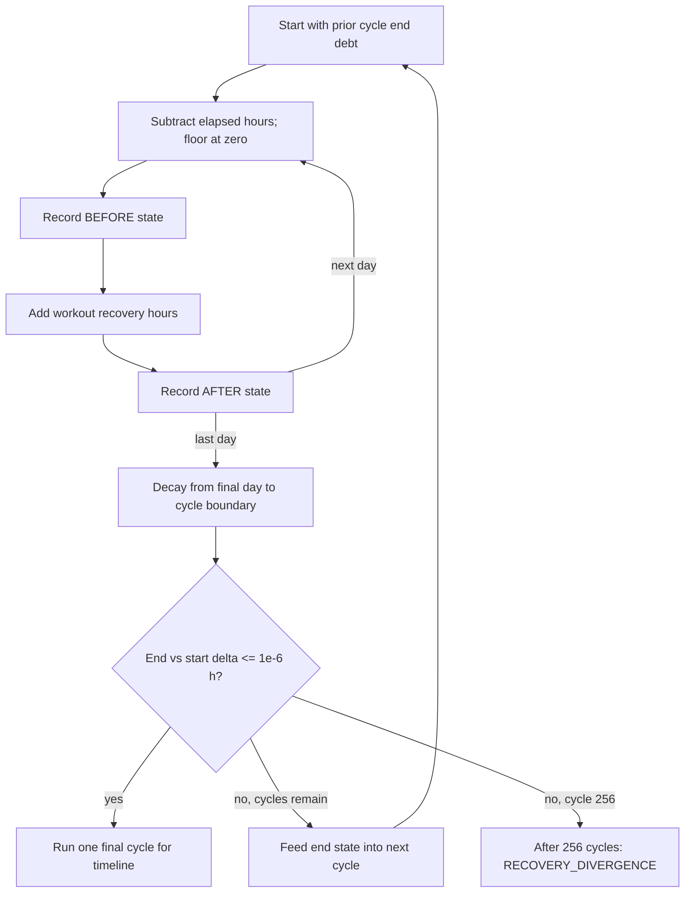
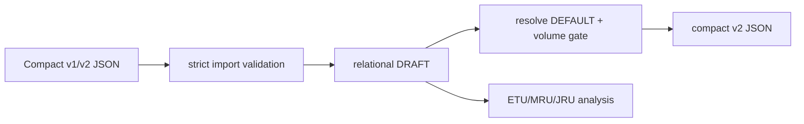

# Execution and calculation pipeline

Agonez currently has two distinct “execution” meanings:

1. submitting/persisting a plan prescription; and
2. executing an in-memory analysis of that persisted prescription.

It does **not** yet model an athlete performing a workout. There are no execution/session/result tables.

## End-to-end plan submission



### Structural rules

- Day, slot, variant, and set ordinals must be exactly `0..n-1` in submitted order.
- A day may omit `workout_unit`; this represents rest.
- A populated slot must contain exactly one DEFAULT variant.
- RIR is 0–4, reps are positive, and rep max cannot be below min.
- Set `min_volume_level` and resolution levels are nonnegative integers.
- Loading cycles contain 2–52 enum values.

## Draft-to-analysis resolution



For a slot with `volume_axis`:

```text
effective_volume_level =
    axis_overrides[volume_axis] if present
    else global_volume_level
```

`focus_area` is preserved in the result but does not affect resolution. Loading modes and cycles also do not affect the resolved plan. Only DEFAULT variants participate; FALLBACK variants remain dormant alternatives.

Every day is spaced by its zero-based ordinal at 24-hour intervals. A stored ISO weekday does not determine timing; inconsistent adjacent weekdays produce an informational diagnostic.

## Contribution calculation



Exact current formulas:

```text
effective_reps = EFFECTIVE_REPS_BY_RIR[rir]

set_etu[muscle] = effective_reps * etu_vector[muscle]

base_mru[muscle] =
    effective_reps
    * active_tension_exposure_vector[muscle]
    * muscle_recovery_cost_modifier_vector[muscle]

set_mru[muscle] =
    base_mru
    * rir_recovery_multiplier[rir]
    * cumulative_set_multiplier(prior_contributing_sets_for_muscle)

joint_load_exposure[joint] =
    effective_reps * joint_load_exposure_vector[joint]

set_jru[joint] =
    joint_load_exposure
    * rir_recovery_multiplier[rir]
    * cumulative_set_multiplier(prior_contributing_sets_for_joint)
```

The concrete rep range is returned as prescription/provenance but does not enter current ETU/MRU/JRU equations. Effective reps depend only on RIR.

The cumulative counter is shared across all contributing sets/exercises within one workout for each muscle or joint. Only a meaningfully positive base contribution increments it.

## Intent classification

For each muscle contribution:



This classification does not change the calculated contribution; it partitions summary totals.

## Workouts to recovery hours

Contributions are summed per workout and resource.

```text
muscle_recovery_hours_added =
    (workout_mru / muscle.pcsa_projected_fcsa_cm2) / 0.70

joint_recovery_hours_added = workout_jru / 1.05
```

The code names these constants `MUSCLE_RECOVERY_VELOCITY_V1` and `JOINT_RECOVERY_VELOCITY_V1`, although the emitted overall model version is `plan-analysis-v2`. They are engineering parameters, not physiological constants. A missing/nonpositive FCSA prevents normalized ETU and muscle recovery conversion and emits `MISSING_FCSA`.

## Periodic recovery simulation



Current cycle length is:

```text
microcycle_hours = number_of_days * 24
microcycle_weeks = number_of_days / 7
weekly_normalization_factor = 7 / number_of_days
```

This is not always 168 hours. A seven-day plan yields 168; a two-day plan yields 48. Empty plans produce zero-duration/zero-factor summaries without division.

## Result construction

`PlanAnalysisResult` returns:

- exact draft identity/version and echoed resolution context;
- timing assumptions and all model parameters;
- convergence status and simulated cycle count;
- absolute and weekly-normalized plan/muscle/joint summaries;
- before/after recovery timeline including rest days;
- per-set contribution provenance with stable plan/catalog IDs;
- nonfatal data-quality and divergence diagnostics.

## Engine-data failure behavior

- Missing exercise enrichment: skip active sets and emit `MISSING_ENGINE_EXERCISE`.
- Missing whole vector: preserve calculable partial result and emit `MISSING_*_VECTOR`.
- Invalid, negative, boolean, or non-finite entries: drop entries and emit `MALFORMED_*_VECTOR`.
- Active-tension/recovery-modifier key mismatch: omit MRU for that muscle and emit `MALFORMED_RECOVERY_VECTOR_KEYS`.
- Recovery nonconvergence: return the last inspectable cycle with an ERROR diagnostic; do not clamp or fail HTTP.

## Import/export pipeline



Import role inference per non-rest day is fixed: first exercise is PRIMARY_PROGRESSIVE, second is SECONDARY_PROGRESSIVE, and later exercises are ACCESSORY. `VOLUME_ACCUMULATION` is never inferred. Export includes only active DEFAULT exercises with at least one active set.

## Not implemented

There is no conversion from a plan to a scheduled prescription with kilograms, no performed-workout execution, no progression controller, no update from performance back into progression state, and no persisted fatigue/recovery timeline. The model currently stops at prescription authoring and derived analysis.
